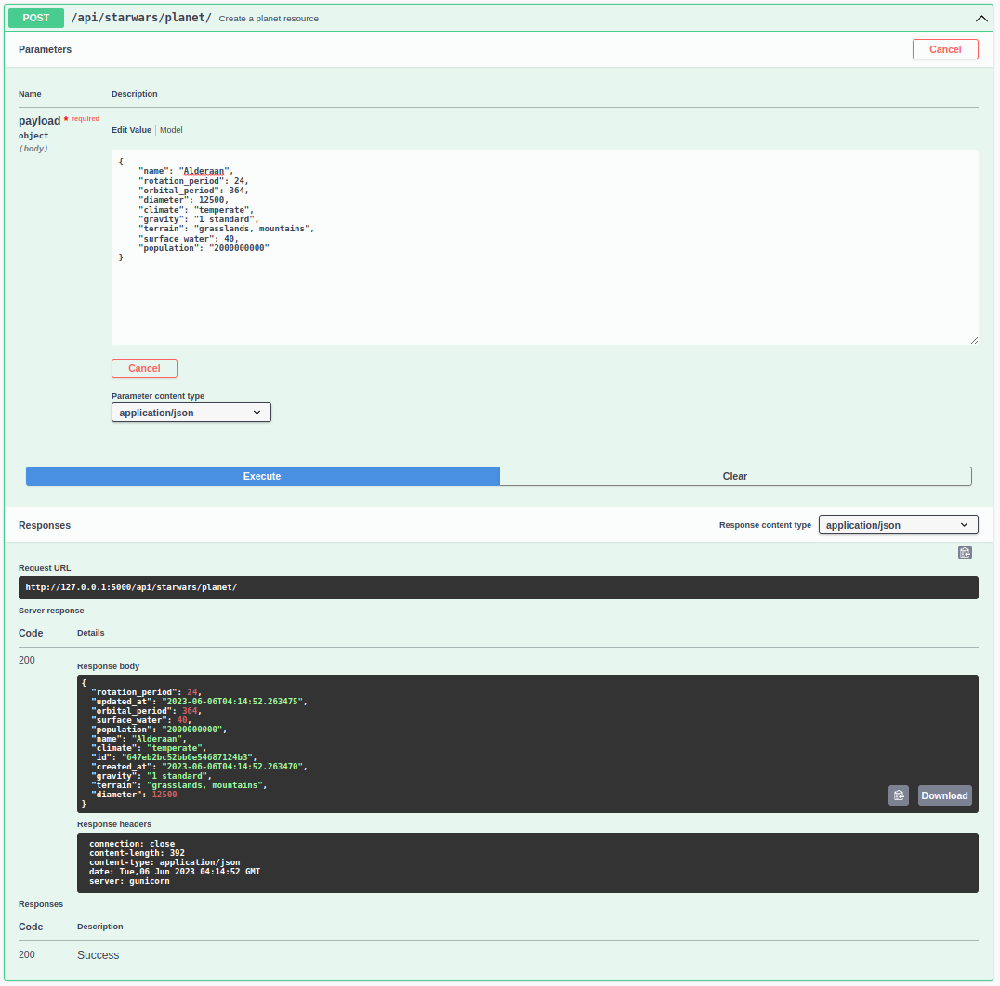
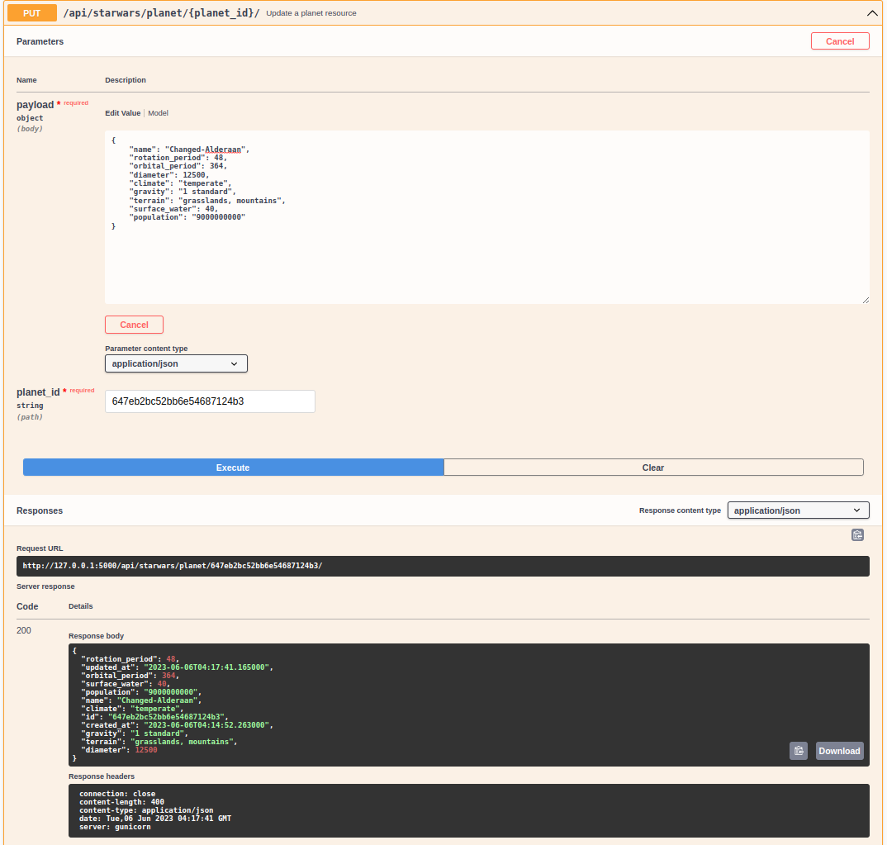

# starwars_api

Esse é um projeto de exemplo de caso de uso das tecnologias: (**Flask Framework**) com banco bancos de dados **no-sql** (**MongoDB**) orientado a *documentos*.

Esse projeto implementa alguns recursos simples para gestão de dados dos filmes da sagas StarWars. E foi inspiridado na API: [https://swapi.dev/](https://swapi.dev/).

Diferentemente do [https://swapi.dev/](https://swapi.dev/) que foi construido em **Django**, esse projeto visa implementar conceitos e boas práticas de arquitetura mais abrangente, estruturando o **Framework Flask** para um grande projeto, com o sentido de abrir mais de um escopo de dados, não se restringindo apenas a `starwars_api`. 


# Instalação

A instalação mais indicada é atraves do [Docker](https://docs.docker.com/engine/install/) e [docker-compose](https://docs.docker.com/compose/install/) caso você não possua instalado na sua maquina, providencie a instalação atraves dos links prévios.

## Instalando com o docker-compose

Basta apenas executar os seguintes comandos abaixo:

```sh
git clone https://github.com/samukasmk/starwars_api.git

cd starwars_api

docker-compose up --build

http://127.0.0.1:5000
command: make test
```

## Exemplo de execução da aplicação com o docker-compose


# Utilizando a API Rest

Após os passoes anteriores tiverem sido executados com sucesso e executando, connect na url de seu computador: [http://127.0.0.1:5000/](http://127.0.0.1:5000/).


Atualmente essa API implementa 2 endpoints:

## Planets

Endpoint que faz a gestão básicas de dados dos planetas que aparecem nos filmes dos StarWars, como população, diametro, gravidade, periodo da orbita, periodo de rotação. 

### Métodos aplicados:

 **Método** | **Endpoint**                              | **Descrição**                                                                                             
------------|-------------------------------------------|-----------------------------------------------------------------------------------------------------------
 **GET**    | /api/starwars/planet/                     | Listar todos os recursos dos planetas                                                                     
 **GET**    | /api/starwars/planet/?movies_details=true | Liste todos os recursos dos planetas, com informações relacionadas ao filme no campo **”movies_details"** 
 **GET**    | /api/starwars/planet/{planet_id}/         | Recupere um recurso do planeta                                                                            
 **GET**    | /api/starwars/planet/{planet_id}/         | Recupere um recurso do planeta, com informações relacionadas ao filme no campo **”planets_details"**      
 **POST**   | /api/starwars/planet/                     | Criar um recurso do planeta                                                                               
 **PUT**    | /api/starwars/planet/{planet_id}/         | Atualizar um recurso do planeta                                                                           
 **PATCH**  | /api/starwars/planet/{planet_id}/         | Atualização parcial de um recurso do planeta                                                              
 **DELETE** | /api/starwars/planet/{planet_id}/         | Excluir um recurso do planeta     

### Campos alteraveis:
- **name** `<StringField>`
- **rotation_period** `<IntField>`
- **orbital_period** `<IntField>`
- **diameter** `<IntField>`
- **climate** `<StringField>`
- **gravity** `<StringField>`
- **terrain** `<StringField>`
- **surface_water** `<IntField>`
- **population** `<StringField>`

### Campos read-only:
- **id** `<objectId>`: Garante especificação do documento e concede a relação externa de n-para-n de para com os **Filmes** 
- **movies** `<array>`: Exibe a relação entre os planetas e os filmes apenas como leitura, a escrita deve ser feito pelo endpoint **Filmes** previnindo erros de ma gestão de dados;
- **movies_details** `<object>`: Exibe uma versão mais detalhada da relação com os recursos de **Filmes**, para ser exibida necessita do parametro: **?movies_details=true**
- **created_at** `<datetime>`: Gestão de criação dos documentos;
- **updated_at** `<datetime>`: Gestão de ediação dos documentos;

Exemplos de uso:

#### Criando um planeta


#### Listando os planetas criados


#### Listagem detalhada dos filmes relacionados


#### Atualização parcial de campos especificos dos planetas


#### Atualização dos campos de um planeta


## Filmes

Endpoint que faz a gestão básicas de dados dos `movies` com as suas respectivas aparições em cada filme. 

### Métodos aplicados:

 **Método** | **Endpoint**                                  | **Descrição**                                                                                            
------------|-----------------------------------------------|----------------------------------------------------------------------------------------------------------
 **GET**    | /api/starwars/movie/                          | Listar todos os recursos de filmes                                                                       
 **GET**    | /api/starwars/movie/**?planets_details=true** | Listar todos os recursos de filmes (com informações relacionadas ao filme no campo **”movies_details"**) 
 **POST**   | /api/starwars/movie/                          | Criar um recurso de filme                                                                                
 **PUT**    | /api/starwars/movie/{movie_id}/               | Atualizar um recurso de filme                                                                            
 **PATCH**  | /api/starwars/movie/{movie_id}/               | Atualização parcial de um recurso de filme                                                               
 **GET**    | /api/starwars/movie/{movie_id}/               | Recuperar um recurso de filme                                                                            
 **DELETE** | /api/starwars/movie/{movie_id}/               | Excluir um recurso de filme      


### Campos alteraveis:
- **title**: `<StringField>`
- **opening_crawl**: `<StringField>`
- **episode_id**: `<IntField>`
- **director**: `<StringField>`
- **producer**: `<StringField>`
- **release_date**: `<DateField>`
- **planets** `<array>`: Exibe a relação entre os planetas e os filmes, a escrita deve ser feito pelo endpoint **Filmes** previnindo erros de ma gestão de dados;

### Campos read-only:
- **id** `<objectId>`: Garante especificação do documento e concede a relação externa de n-para-n de para com os **Planets**
- **planets_details** `<object>`: Exibe uma versão mais detalhada da relação com os recursos de **Planets**, para ser exibida necessita do parametro: **?planets_details=true**
- **created_at** `<datetime>`: Gestão de criação dos documentos;
- **updated_at** `<datetime>`: Gestão de ediação dos documentos;


Exemplos de uso:

#### Criando um Filme já o associando a 2 Planetas 


#### Listagem detalhada dos Planetas relacionados


#### E por ai vai...
Visite o swagger e descubra por conta própria

# Arquitetura e estrutura de pastas do projeto:

```
├── docker-compose.yml: Arquivo de definição dos serviços
├── Dockerfile: Arquivo de definição dos containers
├── Makefile: Script com comandos operacionais repetivos
├── manage.py: Script de execução do projetos
├── pyproject.toml: Arquivo com configurações de Desenvoolvimento
├── requirements-dev.txt: Dependencias dinamicas de desenvolvimento (gerados pelo Poetry)
├── requirements.txt: Dependencias dinamicas de produção (gerados pelo Poetry)
├── scripts: 
│   └── git-hooks: Scripts e automações com o git
├── settings.toml: **Arquivo com as configurações de produção da aplicação**
├── starwars_api: **Pasta da aplicação**
│   ├── extensions: Inicializadores do Flask que executam .init_app(app)
│   ├── models: Define estruturas de dados 
│   └── rest_apis: 
│       └── starwars: 
│           ├── endpoints: Views e controllers da api rest
│           ├── queries: Queries de agregração com o mongodb
│           ├── routes.py: Rotas de URL dos endpoints
│           ├── serializers: Serializão a entrada de dados JSON -> MongoDB Document e vice e versa
│           └── validators: Define validações de campos de entrada a API Rest e swagger devem ter
└── tests: 
    ├── datasets: Dados de casos de testes
    └── fixtures: Fixtures de testes unitários
```

# Desenvolvimento

## Executando testes unitários de forma local
```
make test
```

### Formatando arquivos python e importações
```shell
make fmt
```

### Atualizado arquivos de requirements com poetry:
1.) Adiciona novas dependencias no arquivo **pyproject.toml**

2.) Executa poetry atraves do comando make:
```
make build-requirements
```

### Executando checagens de segurança
```
make sec-check
```