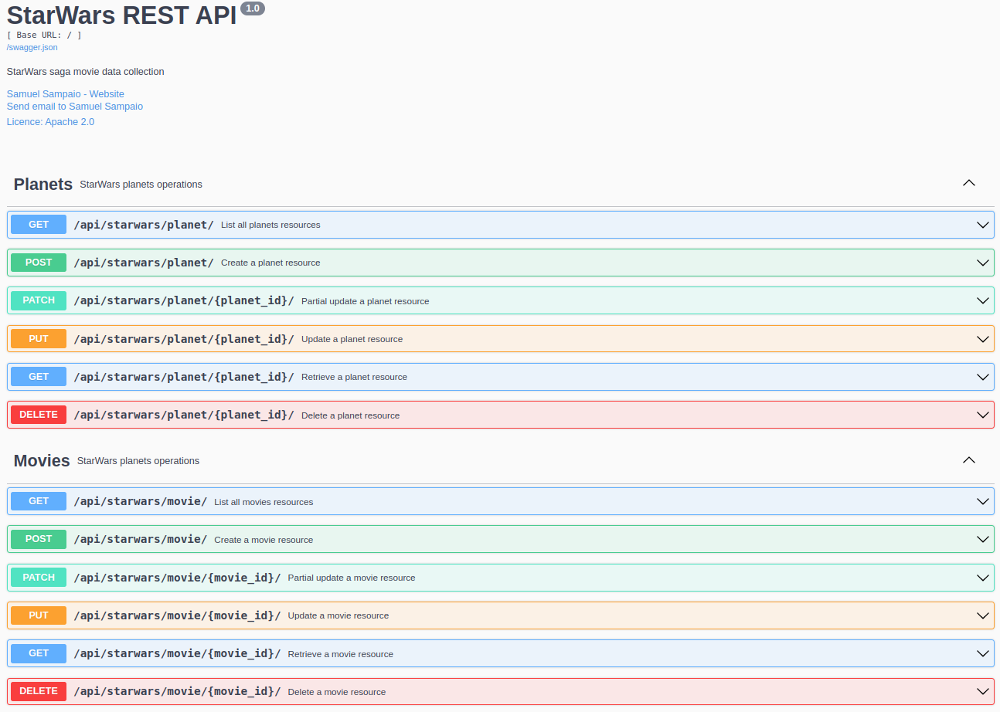
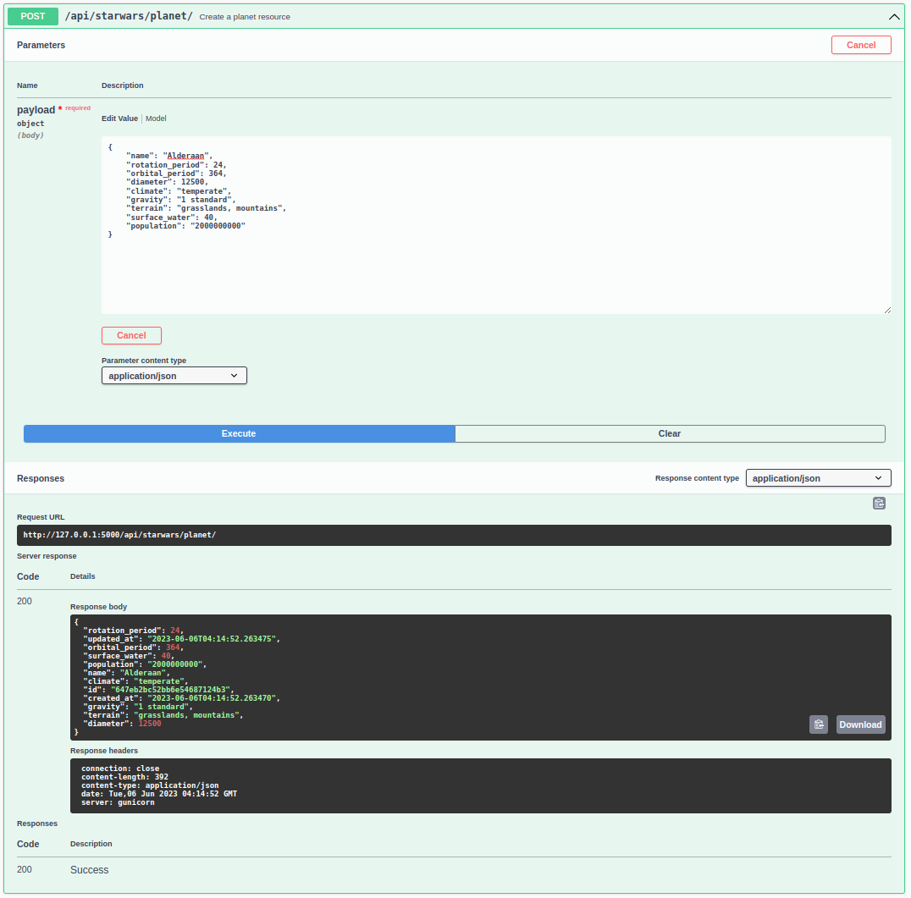
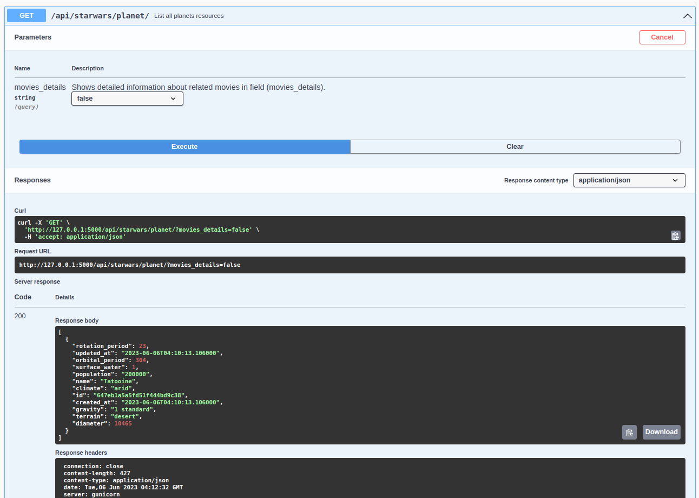
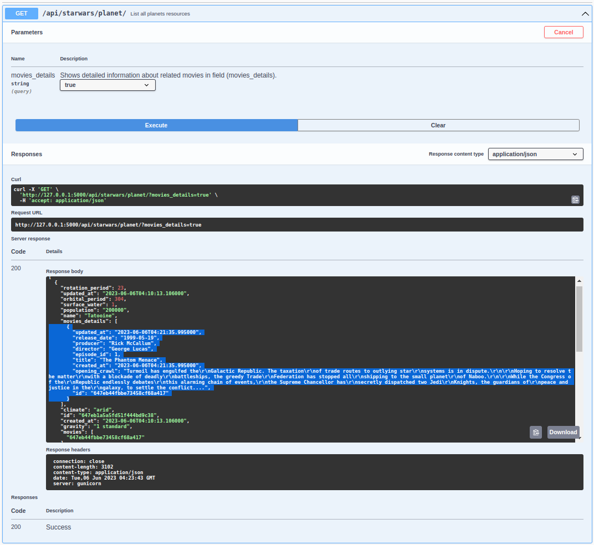
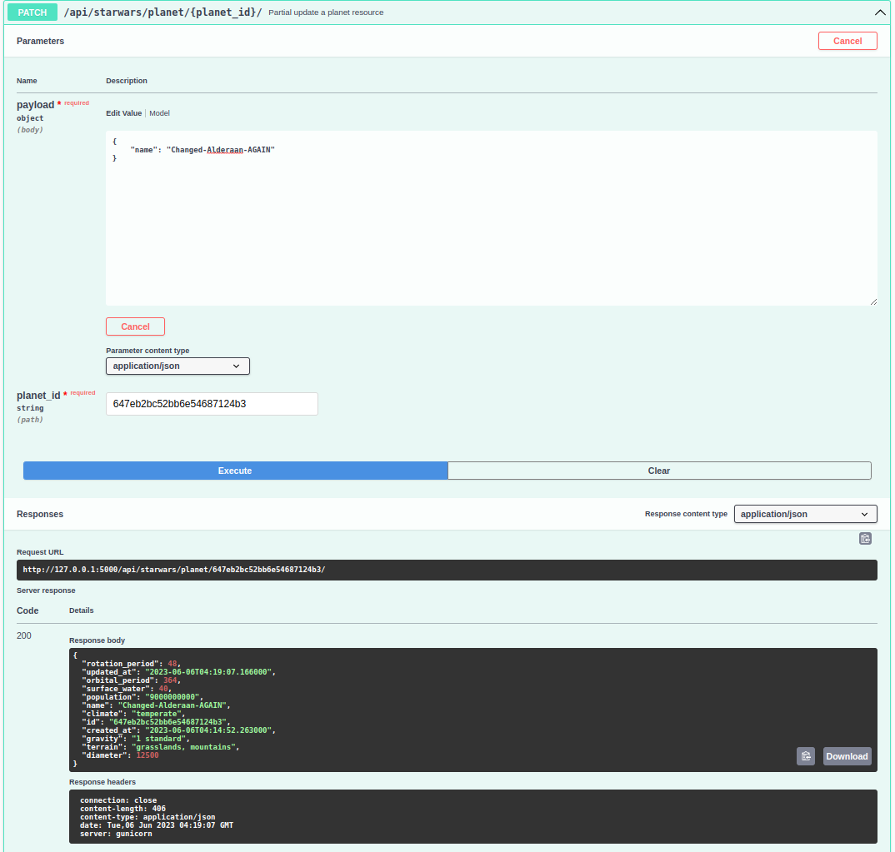
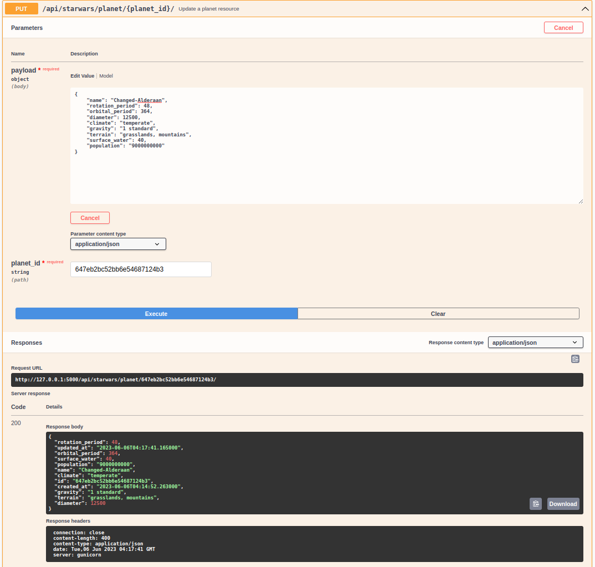
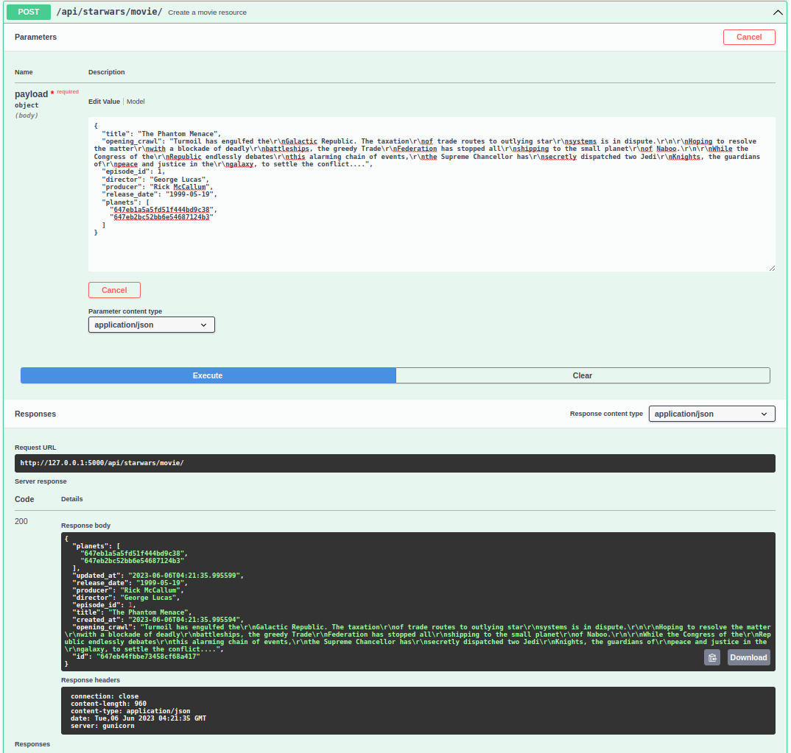
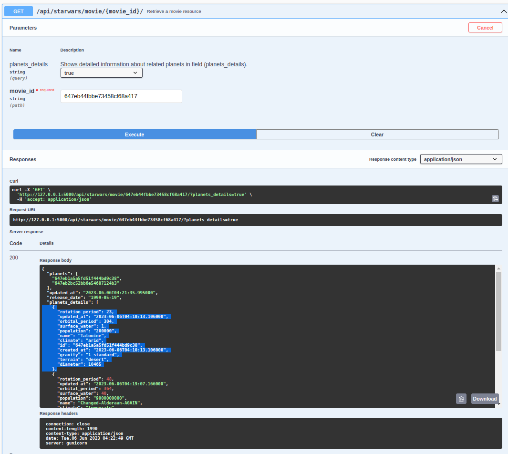
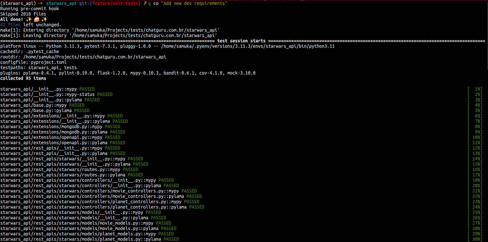
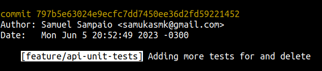

# starwars_api

[README: in Portuguese](README-pt-br.md)

This is an example of use case project for technologies: (**Flask Framework**) with databases **no-sql** (**MongoDB**) oriented to *documents*.

This project implements some simple resources for data management of the StarWars saga movies. And it was inspired by the API: [https://swapi.dev/](https://swapi.dev/).

Unlike [https://swapi.dev/](https://swapi.dev/) which was built in **Django**, this project aims to implement more comprehensive architecture concepts and best practices, structuring the **Framework Flask** for a large project, in the sense of opening up more than one scope of data, not just being restricted to `starwars_api`.


# installing

The most recommended installation is through [Docker](https://docs.docker.com/engine/install/) and [docker-compose](https://docs.docker.com/compose/install/) if you don't have it installed on your machine, arrange the installation through the previous links.

## Installing with docker-compose

Just run the following commands below:

```sh
git clone https://github.com/samukasmk/starwars_api.git

cd starwars_api

docker-compose up --build
```

## Example of running the application with docker-compose


# Using the Rest API

After the previous steps have been successfully performed and running, connect to your computer's url: [http://127.0.0.1:5000/](http://127.0.0.1:5000/).



Currently this API implements 2 endpoints:

## planets

Endpoint that manages the basic data of the planets that appear in the Star Wars movies, such as population, diameter, gravity, orbit period, rotation period.

### Applied methods:

 **Method** | **Endpoint**                              | **Description**                                                                                             
------------|-------------------------------------------|-----------------------------------------------------------------------------------------------------------
 **POST**   | /api/starwars/planet/                     | Create a planet resource
 **GET**    | /api/starwars/planet/                     | List all planet resources
 **GET**    | /api/starwars/planet/?movies_details=true | List all planets resources, with movie related information in the field **”movies_details"**
 **GET**    | /api/starwars/planet/<planet_id>/         | Recover a resource from the planet
 **PUT**    | /api/starwars/planet/<planet_id>/         | Upgrade a planet resource
 **PATCH**  | /api/starwars/planet/<planet_id>/         | Partial upgrade of a planet resource
 **DELETE** | /api/starwars/planet/<planet_id>/         | Delete a resource from the planet                                                                         


### Changeable fields:
- **name** `<StringField>`
- **rotation_period** `<IntField>`
- **orbital_period** `<IntField>`
- **diameter** `<IntField>`
- **climate** `<StringField>`
- **gravity** `<StringField>`
- **terrain** `<StringField>`
- **surface_water** `<IntField>`
- **population** `<StringField>`

### Read-only fields:
- **id** `<objectId>`: Ensures document specification and grants n-to-n external relationship to **Movies**
- **movies** `<array>`: Displays the relation between the planets and the movies as read only, writing must be done by the **Movies** endpoint preventing errors in data management;
- **movies_details** `<object>`: Displays a more detailed version of the relationship with **Movies** resources, to be displayed it needs the parameter: **?movies_details=true**
- **created_at** `<datetime>`: Document creation management;
- **updated_at** `<datetime>`: Document editing management;

Usage examples:

#### Creating a planet


#### Listing created planets


#### Detailed listing of related movies


#### Partial update of planet specific fields


#### Updating a planet's fields


## Movies

Endpoint that manages the basic data of `movies` with their respective appearances in each movie.

### Applied methods:
 **Method** | **Endpoint**                                  | **Description**             
------------|-----------------------------------------------|---------------------------------
 **POST**   | /api/starwars/movie/                          | Create a movie resource         
 **GET**    | /api/starwars/movie/                          | List all movies resources       
 **GET**    | /api/starwars/movie/**?planets_details=true** | List all movies resources       
 **GET**    | /api/starwars/movie/<movie_id>/               | Retrieve a movie resource    
 **PUT**    | /api/starwars/movie/<movie_id>/               | Update a movie resource         
 **PATCH**  | /api/starwars/movie/<movie_id>/               | Partial update a movie resource 
 **DELETE** | /api/starwars/movie/<movie_id>/               | Delete a movie resource    

### Changeable fields:
- **title**: `<StringField>`
- **opening_crawl**: `<StringField>`
- **episode_id**: `<IntField>`
- **director**: `<StringField>`
- **producer**: `<StringField>`
- **release_date**: `<DateField>`
- **planets** `<array>`: Displays the relationship between the planets and the movies, the writing must be done by the **Movies** endpoint preventing errors in data management;

### Read-only fields:
- **id** `<objectId>`: Ensures document specification and grants n-to-n external relationship to **Planets**
- **planets_details** `<object>`: Displays a more detailed version of the relationship with **Planets** resources, to be displayed it needs the parameter: **?planets_details=true**
- **created_at** `<datetime>`: Document creation management;
- **updated_at** `<datetime>`: Document editing management;


Usage examples:

#### Creating a Movie already associating it with 2 planets


#### Detailed listing of related Planets


#### And so on...
Visit swagger and find out for yourself


# Architecture and folder structure of the project:

```
├── docker-compose.yml: Services definition file
├── Dockerfile: Container definition file
├── Makefile: Script with repetitive operational commands
├── manage.py: Project execution script
├── pyproject.toml: File with Development settings
├── requirements-dev.txt: Dynamic development dependencies (generated by Poetry)
├── requirements.txt: Dynamic production dependencies (generated by Poetry)
├── scripts:
│ └── git-hooks: Scripts and automations with git
├── settings.toml: **File with the application's production settings**
├── starwars_api: **Application Folder**
│ ├── extensions: Flask initializers that run .init_app(app)
│ ├── models: Define data structures
│ └── rest_apis:
│ └── Star Wars:
│ ├── endpoints: Views and controllers from the rest api
│ ├── queries: Aggregation queries with mongodb
│ ├── routes.py: URL routes from endpoints
│ ├── serializers: JSON input serialization -> MongoDB Document and vice versa
│ └── validators: Defines input field validations the Rest API and swagger must have
└── tests:
     ├── datasets: Test case data
     └── fixtures: Unit Test Fixtures
```

# Development

## Code quality

### Types of tests performed in the project

| **Tests**                                         | **Description**                                                                |
|---------------------------------------------------|--------------------------------------------------------------------------------|
| **[pytest](https://docs.pytest.org/)**            | Unit tests for REST APi                                                        |
| **[mypy](https://mypy.readthedocs.io/)**          | Typing tests and input and output annotations of functions, methods, variables |
| **[pyflakes](https://github.com/PyCQA/pyflakes)** | Functional syntax tests that look beyond an import                             |
| **[pylint](https://pylint.readthedocs.io/)**      | Advanced syntax testing with more complex parsing                              |
| **[pycodestyle](https://pycodestyle.pycqa.org/)** | Compatibility tests with pep8 good practices                                   |
| **[radon](https://radon.readthedocs.io/)**        | Cyclomatic complexity tests                                                   |
| **[pylama](https://klen.github.io/pylama/)**      | Aggregator of the tests above, in a unified way                                |
| **[isort](https://pycqa.github.io/isort/)**       | Import Ordering Tests                                                          |
| **[bandit](https://bandit.readthedocs.io/)**      | Discovery tests for security vulnerabilities written in source code            |


> If you want to disable some test, change the settings in the **pyproject.toml** file


### Running unit tests locally
```
make test
```

### Running unit tests through docker
> Note: still need to adjust configuration error in the connection between the flask test container and the test mongo

```
docker-compose up -d mongo_tests
docker-compose run --rm unit-tests
```

### Formatting python files and imports
``` shell
make fmt
```

### Running security checks
```
make sec-check
```


## Agility in development

### Running flask on your local machine


#### In production mode
```
docker-compose up -d mongo
make runserver
```

#### Alternative development modes
```
make devserver

make debugserver
```

### Automating commands with Git Hooks

#### Running unit tests after every commit
```
make activate-commit-checks
```




#### Formatting commit messages with branch name
```
make activate-commit-msg-fmt
```




#### Disabling installed automations from githooks
```
make deactivate-git-hooks
```


## DevOps

### Add new python library

The dependency management is done through the [python-poetry](https://python-poetry.org/) tool that chooses the subversions, in order to find a middle ground so that all the necessary libraries can coexist and at the same time have a constant evolution, avoiding security vulnerabilities.

To add a new required library, do the following:

1.) Locate it in the repository [https://pypi.org/](https://pypi.org/)

2.) Get the current version

3.) Declare it in the dependencies file **pyproject.toml** as a current version or higher.

Example if it is version 1.0.0 of the xpto library, declare it as:
```
xpto = "^1.0.0"
```

4.) Rebuild the requiments.txt files

```
make build-requirements
```

The above command performs the following operations:
- Create a separate virtualenv (only for managing poetry)
- Run poetry install
- Export requirements.txt files

> If you want this reconstruction to be done in your local virtualenv just run the command: **make build-requirements-local**

5.) Rebuild your local virtualenv

To install the new requirements files you can run:

**In production mode:**
```
make install
```

or

**In development mode:**
```
make install-dev
```